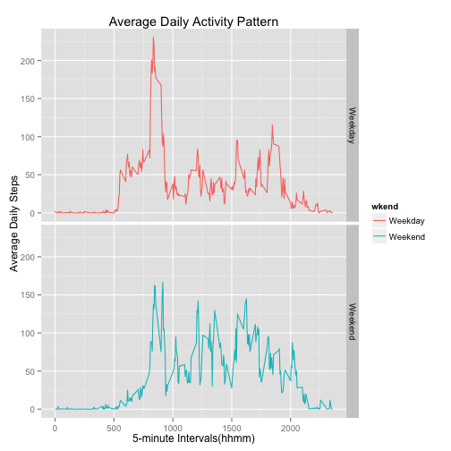

# Reproducible Research - Proj Assignment 1
==========================================

This makes use of data from personal activity monitoring device and
generates calculations and plots.

#### First, set global options to show the code.


```r
library(knitr)
opts_chunk$set(echo = TRUE)
```

#### Read and save the data for program calculations.
- First, set the working directory to the data directory
- Then, read the data using read.csv
- use *rowsum* to calculate the total # of steps/day
- use *hist* to plot total steps/day as a histogram

```r
setwd("~/Desktop/Rwd/ReprodblResrch/RepResData")
pa1data <- read.csv("activity.csv")
steps.day <- rowsum(pa1data$steps, pa1data$date)
hist(steps.day, xlab = "Total # of Steps/day", main = "Number of Steps", col = "red")
```

 

#### Mean and median of total # of steps/day

Calculate mean and median of total number of steps/day [ignore all NA values]


```r
steps.day.mean <- format(mean(steps.day, na.rm = TRUE), nsmall = 3, big.mark = ",")
steps.day.median <- prettyNum(median(steps.day, na.rm = TRUE), big.mark = ",")
```

Mean and median of the total number of steps taken per day are
10,766.189 and 10,765 respectively.

#### Average daily activity pattern


```r
suppressMessages(library(dplyr))
## group data by interval and calculate mean for each interval
## and ignore any NA's in the data
intgrp <- group_by(pa1data, interval)
intmean <- summarize(intgrp, intmean = mean(steps, na.rm = TRUE))
## plot interval vs. average for each interval
with(intmean, plot(interval, intmean, type = "l", main = "Average Daily Activity Pattern", xlab = "5-minute Intervals (hhmm)", ylab = "Average Daily Steps", col = "blue"))
```

 

```r
## calculate the max value and the interval in which that occurs
stepmean.max <- max(intmean$intmean)
stepmean.maxintrvl <- intmean$interval[intmean$intmean == stepmean.max]
stepmean.max <- format(stepmean.max, nsmall = 3, big.mark = ",")
```

The maximum number of steps in any 5-minute interval, averaged across all days, is 206.1698 and this maximum was in interval 835.

#### Inputting missing values


```r
## calculate the total # of missing values (NA's) in each row
steps.na <- sum(is.na(pa1data$steps))
date.na <- sum(is.na(pa1data$date))
interval.na <- sum(is.na(pa1data$interval))
```

The total number of missing values in the data set are

- steps: 2304,
- date: 0, and
- interval: 0.

There are missing values only in the steps column and we shall use the following steps to back-fill the missing values:

1. Merge *pa1data* with *intmean*: this will add a column with average values for each 5-min interval across all days
2. Replace "NA" values in "*steps*" column with corresponding average values
3. Remove "*intmean*" column for the new data set "*pa1datanew*" which is same as the original with the "NA" values replaced

Using the new data set, plot a histogram of total number of steps taken each day, and calculate the the mean and median total number of steps taken each day.


```r
pa1datanew <- merge(pa1data, intmean)
pa1datanew$steps <- with(pa1datanew, ifelse(is.na(steps), intmean, steps))
pa1datanew <- select(pa1datanew, -intmean)
stepsnew.day <- rowsum(pa1datanew$steps, pa1datanew$date)
hist(stepsnew.day, xlab = "Total # of Steps/day", main = "Number of Steps (NA's Replaced)", col = "green")
```

 

```r
stepsnew.day.mean <- format(mean(stepsnew.day), nsmall = 3, big.mark = ",")
stepsnew.day.median <- format(median(stepsnew.day), nsmall = 3, big.mark = ",")
```

Mean and median of the total number of steps taken per day using the new data set are 10,766.189 and 10,766.189 respectively. As a comparison, the same values for the original data with the "NA" values were 10,766.189 and 10,765 respectively. Since we replaced the missing values with the mean values for each interval, the new mean and median are very close to the original values.

#### Weekday/weekend activity patterns


```r
## add a new wkend column calculated as Weekend if the days are Sat or Sun
## if not, as Weekday
pa1datanew$date <- as.Date(pa1datanew$date)
pa1datanew$wkend <- as.factor(ifelse(weekdays(pa1datanew$date) %in% c("Saturday","Sunday"), "Weekend", "Weekday"))
## group date by wkend and then by interval
wdintgrp <- group_by(pa1datanew, wkend, interval)
## calculate inteval means for Weekend and Weekday
wigrpmean <- summarize(wdintgrp, wdmean = mean(steps))
## create weekend and weekday data sets using the value of wkend
wkends <- filter(wigrpmean, wkend == "Weekend")
wkdays <- filter(wigrpmean, wkend == "Weekday")
## plot weekend and weekday data as 2 plots
## set the margins smaller, set to print in 1 x 2 layout and
## lower the separation of the axis labels for a better look
par(mar=c(3,3,2,1), mfcol = c(2,1), mgp = c(1.5, 0.5, 0))
with(wkends, plot(interval, wdmean, type = "l", main = "Weekend Activity Pattern", xlab = "5-minute Intervals (hhmm)", ylab = "Average Weekend Steps", col = "red"))
with(wkdays, plot(interval, wdmean, type = "l", main = "Weekdays Activity Pattern", xlab = "5-minute Intervals (hhmm)", ylab = "Average Weekdays Steps", col = "green"))
```

 

The above plots show the average number of steps across all weekdays [top plot] and all weekend days [bottom plot].

##### Note: an alternate way to get the same panel plots by using ggplot2.


```r
wigrpmean <- summarize(wdintgrp, wdmean = mean(steps))
suppressMessages(library(ggplot2))
qplot(interval, wdmean, data = wigrpmean, facets = wkend ~. , geom = "line", main = "Average Daily Activity Pattern", xlab = "5-minute Intervals(hhmm)", ylab = "Average Daily Steps", color = wkend)
```

 

